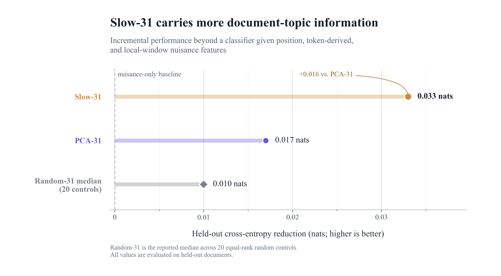

# Residual Stream Geometry Experiment

Code, protocol, and technical appendix for the experiments behind
[The residual stream has a geometry of time](https://www.lesswrong.com/posts/jkEnRkokmzvvKNzzB/the-residual-stream-has-a-geometry-of-time-1).

The project studies whether directions in the residual stream of
`google/gemma-2-2b` have structured within-document persistence, whether slow
directions form a compact subspace, and what information that subspace carries.

## Main results

- Most residual-stream directions forget within roughly one token, while a
  31-dimensional time-lagged subspace persists much longer.
- Random rotations inside that span remain slow, even though persistence is
  concentrated in only a few effective modes.
- The span is not recovered by taking the top 31 residual PCA directions.
- A separate supervised audit found that Slow-31 carried more held-out
  document-topic information than PCA-31 or 20 matched random rank-31 controls.
  This was statistically positive for the frozen coarse-topic endpoint, but is
  only moderate evidence for a semantic interpretation because topic may proxy
  other durable document properties such as source or style.
- Post-publication experiments recovered the signed slow region independently
  across document halves, separated content from measured source/style
  fingerprints, and found a broader graded slow shoulder extending to roughly
  rank 64.
- In a controlled prefix intervention, a frozen semantic coordinate retained a
  donor-topic-directed effect after 64–256 identical continuation tokens,
  whereas the matched PCA semantic effect rapidly disappeared.



## Appendix

The complete [technical appendix](appendix.md) is maintained
as Markdown so that the public version has a single canonical source.

## Post-publication follow-ups

The completed R1.3–R1.11 audit and follow-up sequence is available in
[`followups/slow-subspace-state/`](followups/slow-subspace-state/README.md),
plus the separate predictive-carrier line in
[`followups/predictive-carriers/`](followups/predictive-carriers/README.md).
It includes the frozen protocols, executable research code, focused tests,
compact decision records, negative results, and the estimator-provenance
correction that distinguishes the canonical signed-TICA object from a later
unsigned optimizer.

The strongest follow-up result changes only the first 256 tokens and then holds
the continuation exactly fixed. At the preregistered 64-token horizon, the
donor-directed semantic difference-in-differences was 0.9256 with a 95%
document-bootstrap interval of [0.6764, 1.1642]. The effect remained positive
at 256 tokens. This establishes a persistent semantic representation induced by
history; it does not establish downstream causal use of that representation.

## Repository layout

```text
appendix.md                                technical appendix in Markdown
artifacts/semantic_audit/                  compact result and decision summaries
followups/slow-subspace-state/             R1.3–R1.11 protocols, code, tests, and compact results
followups/predictive-carriers/             Arm D predictive-carrier reports, specs, and compact results
configs/persistent_state/residual_geometry experiment configurations
docs/                                     methods, run summary, frozen protocol
figures/                                  publication figures
scripts/persistent_state/residual_geometry numbered experiment stages
src/residual_geometry/                    reusable implementation
tests/                                    unit and artifact tests
```

Large generated arrays, model weights, and corpus data are intentionally not
tracked in Git.

## Installation

Python 3.11+ is recommended.

```bash
python -m venv .venv
source .venv/bin/activate
python -m pip install --upgrade pip
python -m pip install -e ".[dev]"
```

CUDA is recommended for model-residual stages. CPU execution is sufficient for
the unit tests and most artifact-only analyses.

## Core residual-geometry pipeline

Run the tests first:

```bash
pytest
```

Validate the environment without loading the model:

```bash
python scripts/persistent_state/residual_geometry/00_validate_env.py \
  --config configs/persistent_state/residual_geometry/smoke.yaml \
  --skip-model-load
```

Run the smoke, pilot, or full pipeline:

```bash
bash scripts/run_residual_geometry.sh smoke
bash scripts/run_residual_geometry.sh pilot
bash scripts/run_residual_geometry.sh full
```

The runner executes stages `00` through `07`: environment validation, context
construction, probe generation, autocorrelation estimation, subspace selection,
projection-collapse controls, attention alignment, and report generation.
Mechanistic and artifact-only follow-ups are kept beside those stages.

## Supervised semantic audit

The prospective protocol is
[docs/protocols/slow-subspace-semantic-audit-r1.md](docs/protocols/slow-subspace-semantic-audit-r1.md).
The corresponding numbered stages are:

```text
54_initialize_slow_semantic_audit.py
55_prepare_slow_semantic_data.py
56_capture_slow_semantic_residuals.py
57_analyze_slow_semantic_profile.py
58_analyze_slow_semantic_geometry.py
59_make_slow_semantic_report.py
```

Each stage accepts an explicit `--run-dir`; stage 54 also requires the frozen
Slow-31 basis and protocol path. The full run used 1,200 document-disjoint C4
documents split 800/200/200, twelve frozen layer-12 positions per document,
PCA-31, and 20 random rank-31 controls inside fit-only PCA-256.

To execute the stages sequentially:

```bash
bash scripts/run_slow_semantic_audit.sh /path/to/run /path/to/slow_basis_rank31.npz
```

Set `SLOW_SEMANTIC_MODEL_PATH` and `SLOW_SEMANTIC_LABELER_PATH` to pinned local
snapshots for an offline cluster run. Otherwise the scripts resolve the frozen
model identifiers and revisions from the protocol.

The sealed-test, document-bootstrap topic estimates were:

| Quantity | Estimate (nats) | 95% CI |
|---|---:|---:|
| Slow-31 information gain | 0.033151 | [0.013353, 0.055950] |
| Slow-31 minus random-31 median | 0.023766 | [0.012704, 0.036279] |
| Slow-31 minus PCA-31 | 0.015859 | [0.004753, 0.027428] |

Register was inconclusive. The follow-up recovered a stable rank-2 coarse-topic
span inside Slow-31, but source/style confounding remains possible and no causal
stage was run. The checked-in
[final report](artifacts/semantic_audit/final_report.md) and
[decision summary](artifacts/semantic_audit/final_summary.json) preserve the
compact outputs; large tensors remain external.

## Rebuilding the figure

```bash
python scripts/figures/make_topic_prediction_gain.py
```

## Citation and license

Citation metadata is in [`CITATION.cff`](CITATION.cff). Code is released under
the [MIT License](LICENSE).
